I work at the intersection of AI research, machine learning experimentation, and full stack software engineering. I build practical AI systems and scalable applications that solve real world problems.

 

## 🧬 Core Profile

<table>
<tr>
<td width="33%" valign="top">

### 🧠 Research

  

🔬 Object Detection  
🧊 3D Medical AI  
💜 Healthcare AI  
🈯 Bengali NLP  
📄 Document Intelligence  
👁️ Vision Language Models

</td>
<td width="33%" valign="top">

### 💻 Engineering

  

🔵 .NET Backend  
⚙️ ASP.NET Core  
🔗 REST APIs  
📊 Financial ERP  
🗄️ Database Systems  
☁️ Cloud Services

</td>
<td width="33%" valign="top">

### 🚀 Building

  

🛰️ SkySeaLand Dataset  
🎯 SkyDet Model  
✒️ AxonWrite  
🤖 AI APIs  
🛠️ Research Tools  
☁️ Cloud AI Systems

</td>
</tr>
</table>

 

## ⚙️ SDLC: Research, Development and Deployment Pipeline

### AI Research Pipeline

```mermaid
flowchart LR
    A[Problem Identification] --> B[Dataset Design and Collection]
    B --> C[Model Design and Development]
    C --> D[Evaluation and Benchmarking]
    D --> E[Explainability and Analysis]
    E --> F[Research Paper and Documentation]
    F --> G[AI System Deployment]

    classDef research fill:#0f172a,stroke:#38bdf8,color:#ffffff,stroke-width:2px;
    classDef deploy fill:#052e16,stroke:#22c55e,color:#ffffff,stroke-width:2px;
    class A,B,C,D,E,F research;
    class G deploy;
```

<table>
<tr>
<td align="center"><b>1. Problem Identification</b> Understand real world problems and define research objectives</td>
<td align="center"><b>2. Dataset Design and Collection</b> Collect, clean, annotate, and structure reliable datasets</td>
<td align="center"><b>3. Model Design and Development</b> Design architectures, train models, and tune experiments</td>
<td align="center"><b>4. Evaluation and Benchmarking</b> Measure results using suitable metrics and benchmark datasets</td>
</tr>
<tr>
<td align="center"><b>5. Explainability and Analysis</b> Interpret predictions using XAI, error analysis, and visual evidence</td>
<td align="center"><b>6. Research Paper and Documentation</b> Prepare papers, reports, model cards, and technical documentation</td>
<td align="center" colspan="2"><b>7. AI System Deployment</b> Deploy models as secure, scalable, reliable, and production ready systems</td>
</tr>
</table>

### Software Engineering Pipeline

<table>
<tr>
<td align="center"><b>Requirements Analysis</b> Gather functional and nonfunctional requirements</td>
<td align="center"><b>System Design and Architecture</b> Design secure, scalable, and maintainable architecture</td>
<td align="center"><b>Backend Development</b> Develop APIs, services, business logic, and integrations</td>
<td align="center"><b>Database Design</b> Design schemas, indexes, queries, and data access layers</td>
</tr>
<tr>
<td align="center"><b>Testing and Quality Assurance</b> Apply unit, integration, security, and system testing</td>
<td align="center"><b>Deployment and DevOps</b> Containerize services and automate delivery pipelines</td>
<td align="center" colspan="2"><b>Monitoring and Maintenance</b> Track health, logs, performance, incidents, and system improvement</td>
</tr>
</table>

 

## 🛠️ Tech Stack

### Languages

### AI, Machine Learning and Data

### Backend and Frameworks

### Databases

### DevOps and Tools

 

## 📊 GitHub Analytics

 

 

 

## 🏆 Research and Engineering Focus

<table>
<tr>
<td width="50%" valign="top">

### Current Research Direction

🔹 Computer vision and object detection  
🔹 Medical AI and clinical intelligence  
🔹 Vision language systems  
🔹 Bengali natural language processing  
🔹 Explainable and trustworthy AI  
🔹 Research automation and document intelligence

</td>
<td width="50%" valign="top">

### Engineering Direction

🔹 Secure backend systems  
🔹 Enterprise API architecture  
🔹 Data intensive applications  
🔹 AI service integration  
🔹 Container based deployment  
🔹 Monitoring, testing, and maintainability

</td>
</tr>
</table>

 

## 🤝 Let Us Connect

  

> Research is to see what everybody else has seen, and to think what nobody else has thought.
>
> Albert Szent Györgyi

