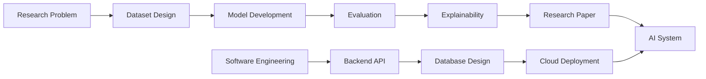

<h2>Hey there! I'm Md. Zahid Hasan Riad</h2>

  <b>AI Researcher</b> · <b>Software Engineer</b> · <b>Prospective PhD Applicant</b>

  I work at the intersection of <b>AI research</b>, <b>machine learning experimentation</b>, and <b>production ready software engineering</b>. My focus is on building practical AI systems in Computer Vision, Healthcare AI, Bengali NLP, Document Intelligence, Vision Language Models, and Cloud based AI applications.

 

<table>
  <tr>
    <td width="33%" align="center">
      <h3>🔬 Research</h3>
      

        Object Detection 
        3D Medical AI 
        Bengali NLP 
        Vision Language Models 
        Document Intelligence
      

    </td>
    <td width="33%" align="center">
      <h3>⚙️ Engineering</h3>
      

        .NET Backend 
        ASP.NET Core 
        Financial ERP 
        REST APIs 
        Database Systems
      

    </td>
    <td width="33%" align="center">
      <h3>🚀 Building</h3>
      

        SkySeaLand Dataset 
        SkyDet Model 
        Healthcare AI Systems 
        AxonWrite 
        Cloud AI Services
      

    </td>
  </tr>
</table>

 

### 🔄 My Work and Research Workflow

### 🎯 Current Focus

  
  
  
  
  
  
  

### 📫 Contact

  

