I work at the intersection of Al research, machine learning experimentation, and
full stack software engineering. I build practical Al systems and scalable applications
that solve real-world problems.

---

## Core Expertise

<table>
<tr>
<td width="50%" valign="top">

### Research

  

* Object Detection
* 3D Medical AI
* Healthcare AI
* Bengali NLP
* Document Intelligence
* Vision Language Models

</td>
<td width="50%" valign="top">

### Engineering

  

* .NET Backend
* ASP.NET Core
* REST APIs
* Financial ERP
* Database Systems
* Cloud Services

</td>
</tr>
</table>

---

## Research and Industry Workflow

### From research problem to measurable industrial impact

```mermaid
flowchart LR

    A[Problem Discovery]
    B[Research Question and Business Need]

    subgraph R[Research Track]
        R1[Literature Review]
        R2[Data Collection and Preparation]
        R3[Model or Method Design]
        R4[Experimentation and Validation]
        R5[Explainability and Research Findings]
        R6[Paper and Technical Documentation]
    end

    subgraph I[Industry Track]
        I1[Requirement Analysis]
        I2[System Architecture]
        I3[Application and API Development]
        I4[Database and Cloud Integration]
        I5[Testing and Quality Assurance]
        I6[Deployment and Operations]
    end

    C[Research and Industry Alignment]
    D[Pilot Implementation]
    E[Performance and Risk Review]
    F[Production Deployment]
    G[Monitoring and Continuous Improvement]
    H[Research Contribution and Business Impact]

    A --> B

    B --> R1
    R1 --> R2
    R2 --> R3
    R3 --> R4
    R4 --> R5
    R5 --> R6

    B --> I1
    I1 --> I2
    I2 --> I3
    I3 --> I4
    I4 --> I5
    I5 --> I6

    R6 --> C
    I6 --> C

    C --> D
    D --> E
    E --> F
    F --> G
    G --> H

    G --> R3
    G --> I2

    classDef start fill:#111827,stroke:#38BDF8,color:#FFFFFF,stroke-width:2px;
    classDef research fill:#1E1B4B,stroke:#8B5CF6,color:#FFFFFF,stroke-width:2px;
    classDef industry fill:#052E16,stroke:#22C55E,color:#FFFFFF,stroke-width:2px;
    classDef integration fill:#172554,stroke:#3B82F6,color:#FFFFFF,stroke-width:2px;
    classDef impact fill:#422006,stroke:#F59E0B,color:#FFFFFF,stroke-width:2px;

    class A,B start;
    class R1,R2,R3,R4,R5,R6 research;
    class I1,I2,I3,I4,I5,I6 industry;
    class C,D,E,F,G integration;
    class H impact;
```

### Workflow Logic

| Phase | Research Responsibility | Industry Responsibility | Main Output |
|---|---|---|---|
| Discovery | Define the research gap | Define the operational need | Shared problem statement |
| Design | Create the method and experiment plan | Create the system architecture | Validated solution design |
| Development | Train and evaluate the model | Build the application and services | Working prototype |
| Validation | Verify accuracy and research quality | Verify reliability, security, and usability | Pilot ready system |
| Deployment | Document findings and limitations | Deploy and monitor the system | Production solution |
| Improvement | Refine the model using evidence | Improve the system using operational feedback | Research and business impact |

---

## Tech Stack

### Languages

### AI, Machine Learning and Data

### Backend and Frameworks

### Databases

### DevOps and Tools

---

</td>
<td width="50%" valign="top">

</td>
</tr>
</table>

---

## GitHub Analytics

  

  

---

<i>Research is to see what everybody else has seen, and to think what nobody else has thought.</i>

 
Albert Szent Gyorgyi

  

