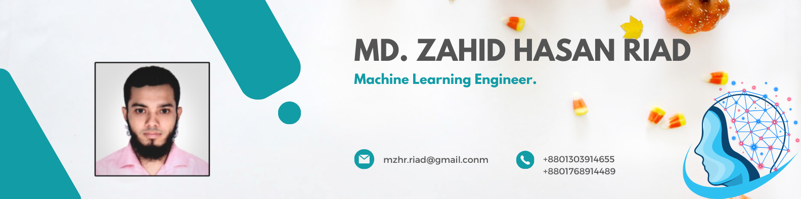

 

<h1>👋 Hey there! I'm Md. Zahid Hasan Riad</h1>

<h3>AI Researcher · Full Stack Developer · Software Engineer · Prospective PhD Applicant</h3>

  I build practical AI systems and scalable full stack applications by combining
  <b>AI research</b>, <b>machine learning experimentation</b>, and
  <b>production ready software engineering</b>.

  
  
  

---

## 🧩 Core Profile

<table>
<tr>
<td width="33%" align="center" valign="top">

<h3>🔬 Research</h3>

  
   
  
   
  
   
  
   
  
   
  

</td>
<td width="33%" align="center" valign="top">

<h3>⚙️ Engineering</h3>

  
   
  
   
  
   
  
   
  
   
  

</td>
<td width="33%" align="center" valign="top">

<h3>🚀 Building</h3>

  
   
  
   
  
   
  
   
  
   
  

</td>
</tr>
</table>

---

## 🔄 SDLC: Research, Development and Deployment Pipeline

mermaid
%%{init: {
  "theme": "base",
  "themeVariables": {
    "background": "transparent",
    "primaryColor": "#0F172A",
    "primaryTextColor": "#FFFFFF",
    "primaryBorderColor": "#38BDF8",
    "lineColor": "#38BDF8",
    "secondaryColor": "#1E3A8A",
    "tertiaryColor": "#065F46",
    "fontFamily": "Inter, Segoe UI, Arial"
  }
}}%%

flowchart LR
    A["🔍 Problem Identification"] --> B["📦 Dataset Design"]
    B --> C["🧠 Model Development"]
    C --> D["📊 Evaluation Benchmarking"]
    D --> E["🔎 Explainability Error Analysis"]
    E --> F["📄 Research Paper"]
    F --> G["🚀 AI System Deployment"]

    H["📋 Requirements Analysis"] --> I["🏗️ System Architecture"]
    I --> J["🔗 Backend Development"]
    J --> K["🗄️ Database Design"]
    K --> L["🖥️ Frontend Development"]
    L --> M["🧪 Testing QA"]
    M --> N["☁️ Deployment DevOps"]
    N --> O["📈 Monitoring Maintenance"]
    O --> G

    classDef research fill:#0F172A,stroke:#38BDF8,stroke-width:2px,color:#FFFFFF;
    classDef engineering fill:#1E3A8A,stroke:#93C5FD,stroke-width:2px,color:#FFFFFF;
    classDef output fill:#065F46,stroke:#5EEAD4,stroke-width:2px,color:#FFFFFF;

    class A,B,C,D,E,F research;
    class H,I,J,K,L,M,N,O engineering;
    class G output;

---

## 🛠️ Tech Stack

<table>
<tr>
<td width="20%" align="center" valign="top">

<h4>Languages</h4>

 

 

 

 

</td>
<td width="20%" align="center" valign="top">

<h4>AI / ML</h4>

 

 

 

 

</td>
<td width="20%" align="center" valign="top">

<h4>Backend</h4>

 

 

 

</td>
<td width="20%" align="center" valign="top">

<h4>Frontend</h4>

 

 

 

</td>
<td width="20%" align="center" valign="top">

<h4>DevOps</h4>

 

 

 

</td>
</tr>
</table>

---

## 🎯 Current Focus

  
  
  
  
  
  
  

---

## 📊 GitHub Analytics

---

## 🤝 Let's Connect

  
  

