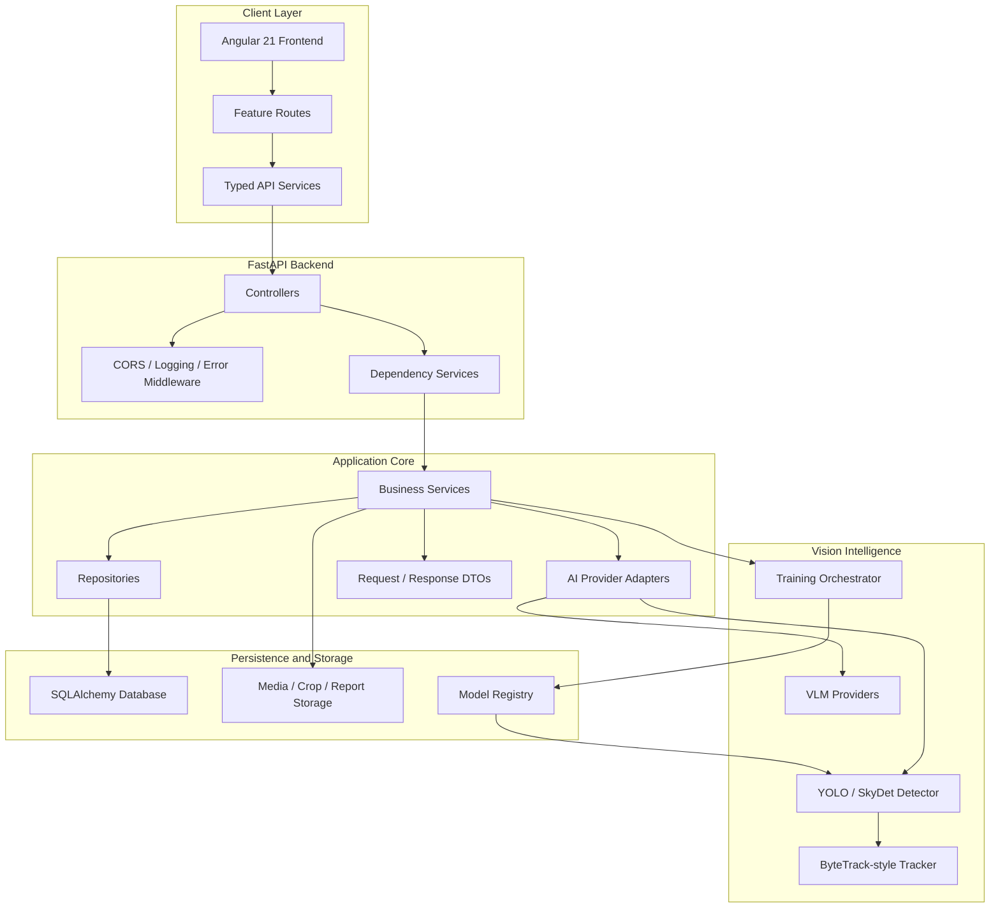
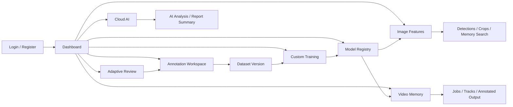
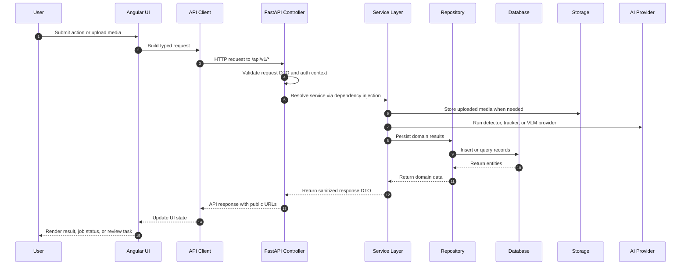
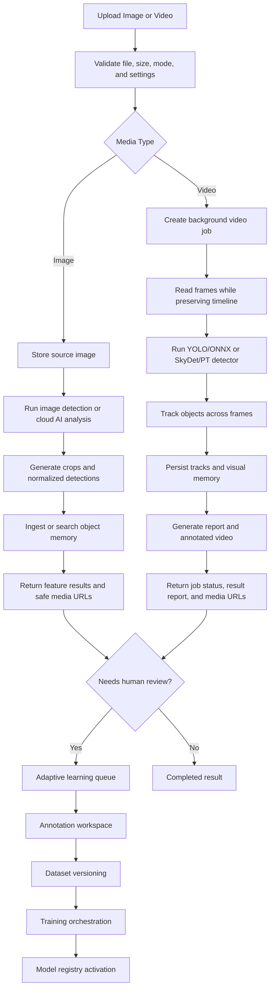
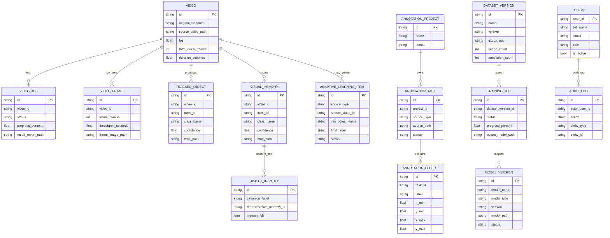
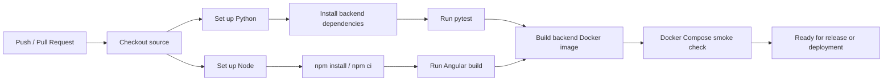

# VMS-X: Adaptive Visual Memory Intelligence Platform

VMS-X is an industry-grade FastAPI + Angular platform for full-timeline video intelligence, object tracking, visual memory, VLM-assisted open-world object naming, human-in-the-loop annotation, dataset versioning, training orchestration, and safe model registry activation.

## Project Owner


### Hey there, I am Md. Zahid Hasan Riad

I am a Computer Science researcher, prospective PhD applicant, and Software Engineer focused on building production-grade AI systems. My work connects deep learning research with practical backend engineering, especially in computer vision, object detection, document intelligence, healthcare AI, and cloud-based AI platforms.

- Research interests: Deep Learning, Computer Vision, NLP, Machine Learning, Generative AI, Large Language Models, Vision-Language Models, and Document Intelligence.
- Current research direction: SkySeaLand Dataset, SkyDet, object detection and classification, 3D medical image classification, healthcare AI, Bengali NLP, VLMs, and cloud-based AI systems.
- Engineering focus: .NET backend development, Financial ERP systems, FastAPI services, Angular applications, AI integration, and scalable data-driven workflows.
- Collaboration areas: AI/ML research, dataset creation, computer vision, document AI, healthcare AI, model evaluation, and research-oriented software platforms.
- Contact: [mzhr.riad@gmail.com](mailto:mzhr.riad@gmail.com)

## Professional Skills

### Programming Languages


### AI, Research, and Data Science


### Frameworks, Platforms, and Tools


### Applied Strengths

- AI vision architecture, object detection pipelines, model registry workflows, and video intelligence systems.
- Backend architecture with clean service layers, repositories, DTOs, authentication, and API security.
- Research-ready software engineering for dataset preparation, training orchestration, evaluation, and reproducible experiments.
- Full-stack delivery with FastAPI, Angular, Docker, SQL databases, and cloud AI provider integration.

## Visual Documentation

- [Project Owner](#project-owner)
- [Professional Skills](#professional-skills)
- [Tech Stack](#tech-stack)
- [System Architecture](#system-architecture)
- [Main User Workflow](#main-user-workflow)
- [Runtime Request Lifecycle](#runtime-request-lifecycle)
- [Image and Video Ingest Workflow](#image-and-video-ingest-workflow)
- [Database Model Diagram](#database-model-diagram)
- [CI Workflow](#ci-workflow)

## Tech Stack

| Layer | Technology | Role |
| --- | --- | --- |
| Frontend | Angular 21, TypeScript, RxJS | Standalone feature UI, routing, API clients, dashboard workflows |
| Backend API | FastAPI, Pydantic DTOs | REST API, request validation, response shaping, OpenAPI docs |
| Service Layer | Python services, dependency injection | Video intelligence, image features, cloud AI, training, registry logic |
| AI / CV | YOLO/ONNX, SkyDet/PT, ByteTrack-style tracking | Detection, tracking, crops, timeline-preserving video memory |
| Cloud AI | Hugging Face, Gemini, OpenAI adapters | VLM object naming, image analysis, report summarization |
| Data Layer | SQLAlchemy, repository pattern | Domain persistence, query boundaries, async database access |
| Storage | Local/Docker volume storage | Uploaded media, crops, reports, generated videos, model artifacts |
| DevOps | Docker, Docker Compose, pytest, Angular build | Reproducible local runtime and verification pipeline |

## System Architecture



### Backend Package Map

| Package | Responsibility |
| --- | --- |
| `vms_api` | FastAPI app, controllers, middleware, dependency services, configuration |
| `vms_services` | Business logic, AI providers, image/video processing, training orchestration |
| `vms_data_access` | Repository implementations and persistence boundaries |
| `vms_domain` | SQLAlchemy entities, database session setup, migration boundary |
| `vms_models` | Request and response DTOs used by API and frontend contracts |
| `vms_utils` | Security, validation, enums, middleware helpers, shared exceptions |

## Main User Workflow



1. The operator signs in and lands on the dashboard.
2. Image and video workflows create detections, crops, tracks, and visual memory records.
3. Uncertain objects move into adaptive review where VLM suggestions can be accepted or corrected.
4. Human-reviewed labels flow into annotation, dataset versioning, and training.
5. Approved model versions are activated through the registry and reused by future detection runs.

## Runtime Request Lifecycle



## Image and Video Ingest Workflow



## Database Model Diagram

The current persistence model uses UUID-style string identifiers and several logical relationships through `*_id` fields.



## CI Workflow



Recommended checks:

```bash
cd backend
pip install -r requirements.txt -r requirements-dev.txt
python -m pytest -q

cd ../frontend
npm install
npm run build

cd ..
docker compose up --build
```

## Run with Docker

```bash
cp backend/.env.docker.example backend/.env.docker
# Set HF_TOKEN and replace JWT_SECRET_KEY in backend/.env.docker, then:
docker compose up --build
```

Backend: http://localhost:8000/docs  
Frontend: http://localhost:4200

## Local backend run

```bash
cd backend
cp .env.example .env
# Set HF_TOKEN in .env
python -m venv .venv
.venv\Scripts\activate  # Windows
pip install -r requirements.txt
python -m vms_api.main
```

Run backend tests with the development dependencies:

```bash
pip install -r requirements-dev.txt
python -m pytest -q
```

## Local frontend run

```bash
cd frontend
npm install
npm start
```

## Notes

- Default video processing is `full_video` with `max_frames=0` and `output_video_fps=0.0`, preserving original video timeline.
- Detection adapter is modular. The Video Timeline Processor lets users choose `YOLO` or `SkyDet` for the same tracking, crop, memory, report, and annotated-video pipeline. Set `YOLO_MODEL_PATH` and `SKYDET_MODEL_PATH` in `backend/.env` or Docker env to override the default model files.
- Image APIs return browser-safe media URLs. Public API responses and the Angular console never expose host or container filesystem locations.
- Cloud AI and adaptive-learning VLM requests use Hugging Face Inference Providers through the backend. Set `HF_TOKEN`, `HUGGINGFACE_VISION_MODEL`, and `HUGGINGFACE_TEXT_MODEL`; the token is never sent to the frontend.
- OpenAI and Gemini remain optional providers. Hybrid mode tries `huggingface,gemini,openai` by default.
- If Hugging Face is unavailable or unconfigured, adaptive learning safely routes the item to human review.


